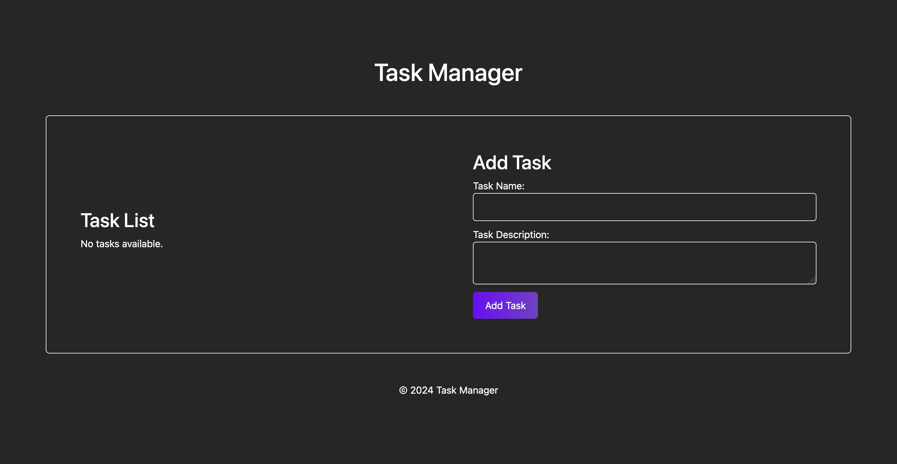

# React Task Manager

## Table of Contents

1. [Introduction](#introduction)
2. [Features](#features)
3. [Dependencies](#dependencies)
4. [Getting Started](#getting-started)
5. [Deployment](#deployment)
6. [Contributing](#contributing)
7. [License](#license)

## Introduction

Task Manager is a web application designed to help users organize and manage their tasks effectively. Whether you're a professional managing multiple projects or an individual keeping track of personal tasks, Task Manager provides an intuitive interface to create, update, and delete tasks effortlessly.

## Features

- **Task Creation**: Easily add new tasks with a name and description.
- **Task Listing**: View a list of all tasks with their details.
- **Task Deletion**: Remove tasks from the list when they're completed or no longer needed.
- **Responsive Design**: Access and manage tasks seamlessly across devices of all sizes.

## Dependencies

### Frontend Dependencies:

- [@vitejs/plugin-react](https://www.npmjs.com/package/@vitejs/plugin-react): Vite plugin for React applications.
- [bootstrap](https://www.npmjs.com/package/bootstrap): Frontend framework for responsive web design.
- [react](https://www.npmjs.com/package/react): JavaScript library for building user interfaces.
- [react-dom](https://www.npmjs.com/package/react-dom): DOM-specific methods for React.
- [vite](https://www.npmjs.com/package/vite): Build tool that offers lightning-fast frontend development experience.

### Backend Dependencies:

- [@apollo/server](https://www.npmjs.com/package/@apollo/server): GraphQL server implementation for Node.js.
- [cors](https://www.npmjs.com/package/cors): Middleware for enabling CORS (Cross-Origin Resource Sharing) in Express.
- [dotenv](https://www.npmjs.com/package/dotenv): Loads environment variables from a `.env` file into `process.env`.
- [express](https://www.npmjs.com/package/express): Web application framework for Node.js.
- [graphql](https://www.npmjs.com/package/graphql): JavaScript implementation of the GraphQL specification.
- [mongodb](https://www.npmjs.com/package/mongodb): MongoDB driver for Node.js.
- [mongoose](https://www.npmjs.com/package/mongoose): MongoDB object modeling for Node.js.
- [sequelize](https://www.npmjs.com/package/sequelize): Promise-based Node.js ORM for Postgres, MySQL, MariaDB, SQLite, and Microsoft SQL Server.
- [nodemon](https://www.npmjs.com/package/nodemon): Utility that monitors changes in your source code and automatically restarts the server.

## Getting Started

To get started with the Task Manager application, follow these steps:

1. Clone the repository to your local machine:

   ```bash
   git clone <repository-url>


## How To Use
```bash
npm install
npm run build
npm run develop
```

